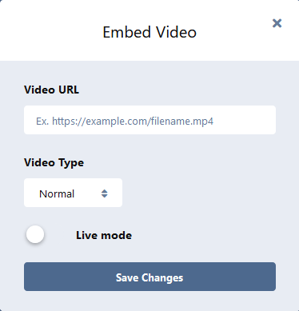

# Embed Video

> A [Flarum](https://flarum.org) extension that allow users to embed video (DPlayer) using BBCode.


Click the cat button to open the modal below



## Installation

```sh
composer require nearata/flarum-ext-embed-video
```

## Updating

```sh
composer update nearata/flarum-ext-embed-video
php flarum cache:clear
```

## Remove

```sh
composer remove nearata/flarum-ext-embed-video
php flarum cache:clear
```

## License

Distributed under the MIT license. See `LICENSE` for more information.

## Contributing

1. Fork it
2. Commit your changes
3. Push to the branch
4. Create a new Pull Request

## Credits

- [MoePlayer/DPlayer](https://github.com/MoePlayer/DPlayer) ([DIYgod](https://github.com/DIYgod)) for the HTML5 video player
